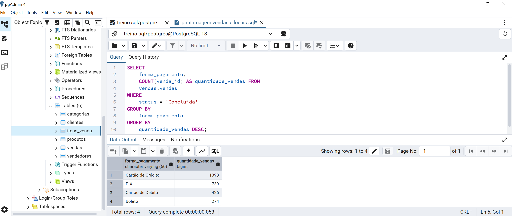
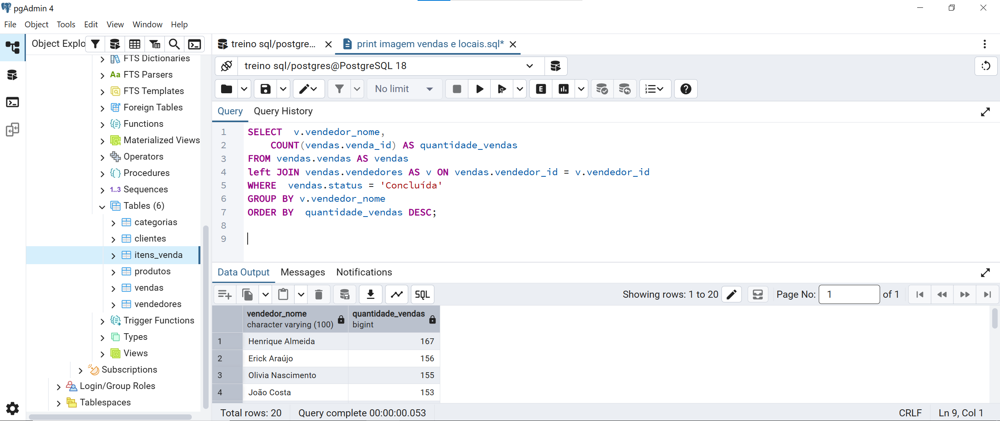
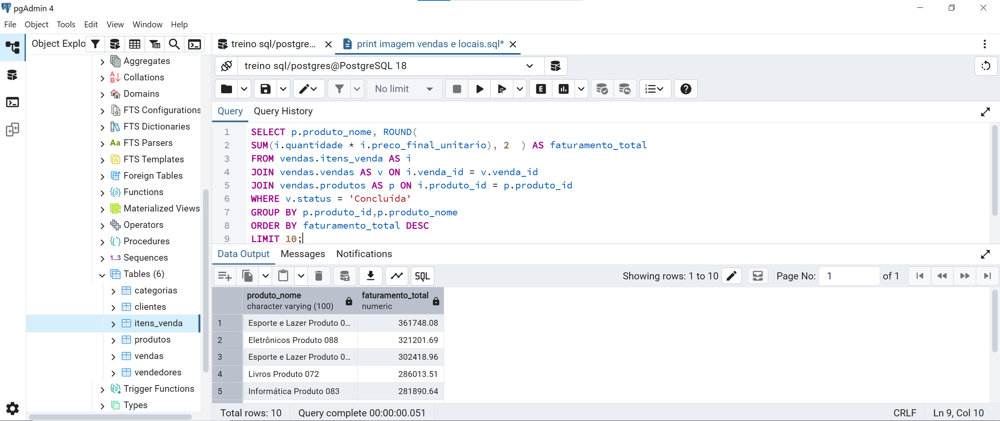
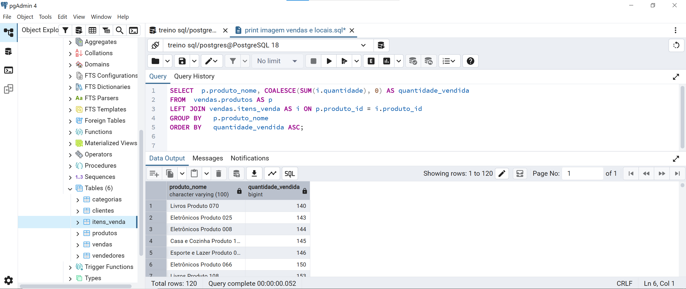
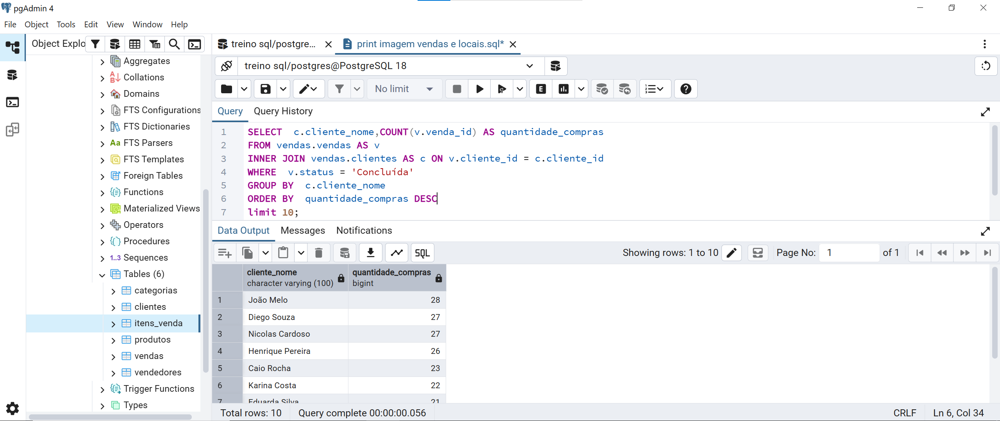
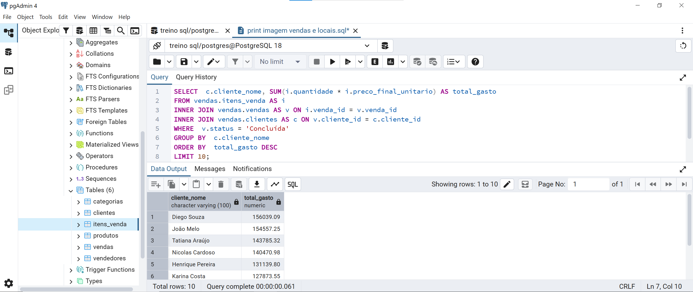
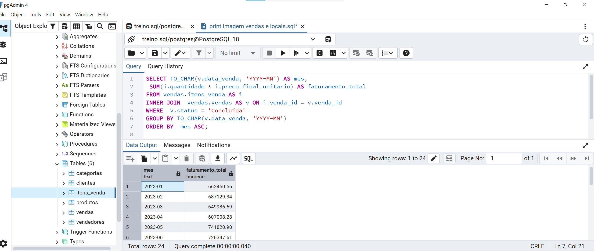
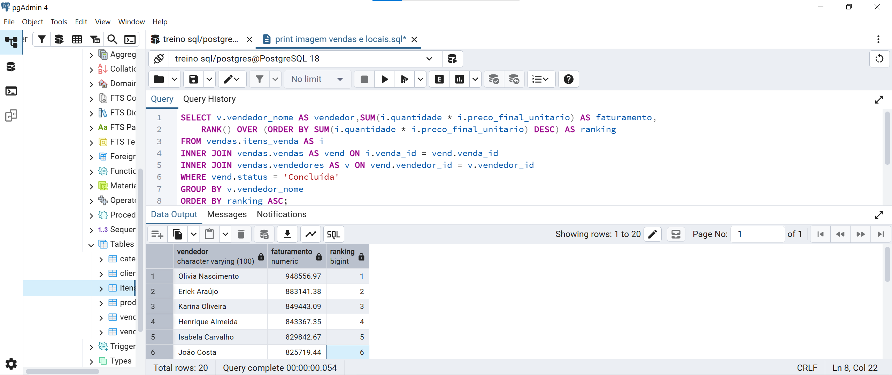

# 📊 Análise de Vendas com SQL

Projeto de análise de dados desenvolvido utilizando **PostgreSQL**, com o objetivo de explorar uma base fictícia de vendas e responder perguntas de negócio por meio de consultas SQL.

Este projeto faz parte do meu processo de aprendizado e construção de portfólio na área de **Dados e Business Intelligence**, aplicando na prática conceitos de consultas, relacionamentos entre tabelas, agregações, subqueries e funções de janela.

---

## 🎯 Objetivo do Projeto

O objetivo foi utilizar SQL para transformar dados brutos de vendas em informações que possam apoiar análises de negócio.

Durante o projeto, foram exploradas questões como:

- 🛒 Quais canais concentram mais vendas?
- 💳 Quais são as formas de pagamento mais utilizadas?
- 👨‍💼 Quais vendedores possuem maior volume de vendas?
- 📦 Quais produtos apresentam maior faturamento?
- 📉 Quais produtos possuem menor movimentação?
- 👥 Quais clientes realizam mais compras?
- 💰 Quais clientes geram maior faturamento?
- 📈 Como o faturamento evolui ao longo dos meses?
- 🏷️ Quais categorias apresentam faturamento acima da média?
- 🏆 Qual é o ranking de vendedores por faturamento?

---

## 🗃️ Base de Dados

A base utilizada no projeto é fictícia e foi estruturada em seis arquivos CSV.

| Tabela | Descrição |
|---|---|
| `clientes` | Informações dos clientes |
| `vendedores` | Cadastro dos vendedores |
| `produtos` | Informações dos produtos |
| `categorias` | Categorias dos produtos |
| `vendas` | Registro das vendas realizadas |
| `itens_venda` | Produtos e quantidades presentes em cada venda |

Os arquivos utilizados estão disponíveis na pasta:

📁 [`dados/`](dados/)

---

## 🛠️ Tecnologias Utilizadas

- 🐘 **PostgreSQL**
- 🖥️ **pgAdmin 4**
- 🧮 **SQL**
- 🐙 **GitHub**

---

## 🧠 Conceitos SQL Aplicados

Durante as análises foram utilizados:

- `SELECT`
- `WHERE`
- `ORDER BY`
- `GROUP BY`
- `HAVING`
- `COUNT()`
- `SUM()`
- `AVG()`
- `ROUND()`
- `COALESCE()`
- `INNER JOIN`
- `LEFT JOIN`
- Subqueries
- Funções de data com `TO_CHAR()`
- Window Functions com `RANK() OVER()`

---

## 🔎 Análises Realizadas

### 1️⃣ Vendas por canal

Análise da quantidade de vendas concluídas em cada canal de venda.


---

### 2️⃣ Formas de pagamento

Identificação das formas de pagamento mais utilizadas pelos clientes.



---

### 3️⃣ Vendas por vendedor

Análise da quantidade de vendas concluídas por vendedor.



---

### 4️⃣ Produtos com maior faturamento

Ranking dos produtos que apresentaram maior faturamento considerando quantidade vendida e preço final.



---

### 5️⃣ Movimentação dos produtos

Análise da quantidade vendida por produto, incluindo produtos sem movimentação através de `LEFT JOIN` e `COALESCE()`.



---

### 6️⃣ Clientes com maior quantidade de compras

Identificação dos clientes que realizaram o maior número de compras concluídas.



---

### 7️⃣ Clientes com maior faturamento

Análise dos clientes que mais contribuíram para o faturamento total.



---

### 8️⃣ Evolução mensal do faturamento

Análise temporal do faturamento para observar sua evolução ao longo dos meses.



---

### 9️⃣ Categorias com faturamento acima da média

Utilização de `HAVING` e **subquery** para comparar o faturamento das categorias com a média geral.


---

### 🔟 Ranking de vendedores por faturamento

Aplicação de **Window Function** utilizando `RANK() OVER()` para criar um ranking dos vendedores de acordo com o faturamento gerado.



---

## 📂 Estrutura do Projeto

```text
analise-vendas-sql/
│
├── 📁 consultas/
│   └── analise_vendas.sql
│
├── 📁 dados/
│   ├── categorias.csv
│   ├── clientes.csv
│   ├── itens_venda.csv
│   ├── produtos.csv
│   ├── vendas.csv
│   └── vendedores.csv
│
├── 📁 imagens/
│   └── resultados das análises
│
└── README.md
```

---


## 💻 Consultas SQL

Todas as consultas desenvolvidas durante o projeto estão organizadas no arquivo:

➡️ [`consultas/analise_vendas.sql`](consultas/analise_vendas.sql)

As consultas foram organizadas de acordo com cada pergunta de negócio analisada no projeto.

---

## 🚀 Próximos Passos

Como evolução deste projeto, pretendo aprofundar as análises e integrar a base com ferramentas de Business Intelligence.

Entre os próximos passos estão:

- 📊 Desenvolvimento de um dashboard no **Power BI**
- 📐 Criação de indicadores e KPIs
- 🧮 Aplicação de medidas utilizando **DAX**
- 🔄 Exploração do processo de tratamento e transformação dos dados
- 🧠 Aplicação de novas consultas SQL conforme avanço nos estudos

---

## 👨‍💻 Sobre o Projeto

Este projeto foi desenvolvido como parte da minha transição profissional para a área de **Dados e Business Intelligence**, buscando aplicar os conhecimentos adquiridos nos estudos de SQL em um cenário prático de análise de vendas.

Além da construção das consultas, o projeto foi organizado para documentar o raciocínio utilizado em cada análise e acompanhar minha evolução prática na área de dados.

---

## 📌 Autor

**Iago Vito Batista**

🎓 Estudante de **Análise e Desenvolvimento de Sistemas**  
📊 Foco em **Dados & Business Intelligence**

**Power BI | SQL | Python | Excel**
